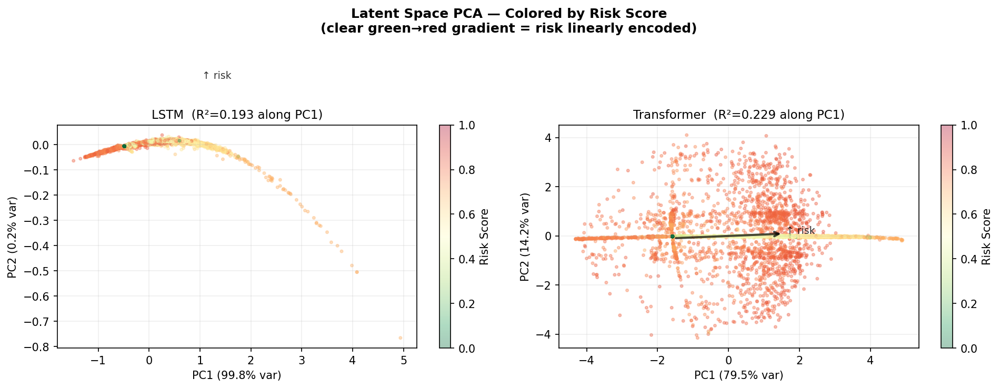
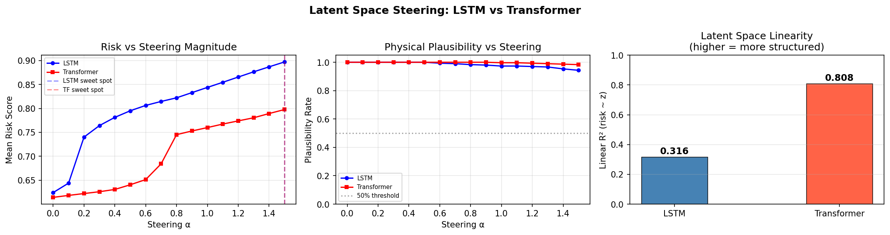

# Latent Space Steering for Controllable Rare Pedestrian Trajectory Generation

**Ananya Arvind** · UC Los Angeles · March 2026

> *Can we steer the latent space of an already-trained trajectory predictor to generate rare, high-activity pedestrian behaviors — without any retraining?*

This repository contains the full implementation of **latent space steering** applied to pedestrian trajectory prediction on the [Stanford Drone Dataset (SDD)](https://cvgl.stanford.edu/projects/uav_data/). We train and compare LSTM and Transformer encoders, probe their latent spaces for behavioral risk structure, and demonstrate controllable rare-behavior generation via inference-time latent perturbation.

📄 **Paper:** [Latent Space Steering for Controllable Rare Pedestrian Trajectory Generation](https://github.com/ananya-arv/latent-steering)

---

## Overview

Standard trajectory prediction models are trained to minimize ADE/FDE — but how well do their latent spaces actually *encode* behavioral risk? And can we exploit that structure to generate rare tail-event behaviors for AV simulation?

We find:
- **Transformer R² = 0.808** vs **LSTM R² = 0.316** — a 2.55× gap in latent risk linearity, invisible to ADE/FDE
- Structured latent steering outperforms random perturbation by **+0.159** (Transformer) and **+0.141** (LSTM)
- Physical plausibility stays above **94%** throughout steering at α = 1.5
- The Transformer produces geometrically diverse steered trajectories (speed, curvature, direction); the LSTM collapses to speed-dominated responses




---

## Repository Structure

```
latent-steering/
├── models/
│   ├── lstm.py              # LSTM encoder + MLP decoder (~145K params)
│   └── transformer.py       # Transformer encoder + MLP decoder (~320K params)
├── utils/
│   ├── dataset.py           # SDD loading, risk score, sliding windows, dataloaders
│   └── steering.py          # PCA whitening, steering vector computation, plausibility
├── train.py                 # Train both models, save checkpoints
├── steer.py                 # Latent probing (R²), steering sweep, random baseline
├── visualize.py             # Generate all figures
├── notebooks/
│   └── colab_training.ipynb # Google Colab notebook
├── checkpoints/             # Saved model weights
├── results/                 # Output figures and summary table
└── requirements.txt
```

---

## Setup

### Requirements

```bash
pip install -r requirements.txt
```

```
torch>=2.0.0
numpy>=1.24.0
pandas>=2.0.0
scikit-learn>=1.3.0
scipy>=1.11.0
matplotlib>=3.7.0
tqdm>=4.65.0
```

### SDD Data

Download the Stanford Drone Dataset annotations from the [official site](https://cvgl.stanford.edu/projects/uav_data/) and place them as follows:

```
latent-steering/
└── SDD/
    └── annotations/
        ├── bookstore/
        │   ├── video0/
        │   │   └── annotations.txt
        │   └── ...
        ├── coupa/
        ├── deathCircle/
        ├── gates/
        ├── hyang/
        ├── little/
        ├── nexus/
        └── quad/
```

The dataset covers 8 scenes across 60 annotation files. Only pedestrian tracks are used.

---

## Usage

### 1. Train

```bash
python train.py
```

Trains both LSTM and Transformer on SDD pedestrian trajectories. Key settings (configurable at top of `train.py`):

| Parameter | Value |
|-----------|-------|
| Observation length | 15 frames (0.5s) |
| Prediction length | 25 frames (0.83s) |
| Stride | 5 frames |
| Batch size | 128 |
| Learning rate | 1e-3 (Adam) |
| Epochs | 50 |
| Rare threshold | risk ≥ 0.85 (held out) |

Checkpoints saved to `checkpoints/lstm_best.pt` and `checkpoints/transformer_best.pt`.

Expected output:
```
Total windows: 782,033
Normal: 479,840 | Rare (held-out): 302,193
Train: 335,888 | Val: 71,976 | Test: 71,976

LSTM best val ADE:        0.0710 m
Transformer best val ADE: 0.0571 m
```

### 2. Steer

```bash
python steer.py
```

Runs latent probing (ridge regression R²), computes the PCA-whitened steering vector, sweeps α ∈ [0, 1.5] over 300 validation trajectories, and compares against a random-direction baseline.

Expected output:
```
LSTM  — Linear R²: 0.316  |  Structured: 0.897  |  Random: 0.756  |  Advantage: +0.141
Transformer — Linear R²: 0.808  |  Structured: 0.798  |  Random: 0.638  |  Advantage: +0.159
```

### 3. Visualize

```bash
python visualize.py SDD/annotations/
```

Generates all figures to `results/`:
- `fig1_pca_latent.png` — PCA projections colored by risk score
- `fig2_steering_examples.png` — steered trajectory examples at α ∈ {0, 0.5, 1.0, 1.5}
- `fig3_kde_risk.png` — KDE of generated risk at increasing α
- `fig4_cv_baseline.png` — ADE/FDE vs constant-velocity baseline
- `fig5_summary.png` — R² and steering advantage summary
- `main_results.png` — full steering sweep results

---

## Method

### Behavioral Risk Score

Each trajectory window is assigned a composite activity score r ∈ [0, 1]:

```
r = 0.35 * r_speed + 0.35 * r_accel + 0.30 * r_turn
```

where `r_speed = min(v_max / 3.5, 1)`, `r_accel = min(a_max / 3.0, 1)`, `r_turn = min(ω_max / 3.0, 1)`. A score near 0 = slow, straight-line motion; near 1 = fast, erratic motion. Windows scoring ≥ 0.85 are treated as *rare* and held out entirely from training.

### Steering Vector

1. Extract latent vectors {z_i} from the validation set
2. Apply PCA whitening (zero mean, unit variance per principal component)
3. Compute mean difference: `w̃ = mean(Z_hi) − mean(Z_lo)` where hi/lo = top/bottom 10% by risk
4. Project back to original space and ℓ₂-normalize
5. At inference: `z' = clip(z + α·w, −0.99, +0.99)`

### Architectures

| | LSTM | Transformer |
|---|---|---|
| Encoder | 2-layer LSTM (hidden 128) | 4-layer self-attention (d=128, 4 heads) |
| Latent | Linear + Tanh → z ∈ ℝ⁶⁴ | Mean-pool + Tanh → z ∈ ℝ⁶⁴ |
| Decoder | Shared MLP (64→128→128→50) | Same |
| Params | ~145K | ~320K |
| Val ADE | 0.071 m | 0.057 m |
| Latent R² | 0.316 | **0.808** |

---

## Results

### Prediction Accuracy

| Method | ADE (m) ↓ | FDE (m) ↓ | ΔADE vs CV |
|--------|-----------|-----------|------------|
| Constant Velocity | 0.137 | 0.265 | — |
| LSTM | 0.071 | 0.135 | −48.0% |
| **Transformer** | **0.057** | **0.106** | **−58.3%** |

### Steering

| | LSTM | Transformer |
|---|---|---|
| Latent R² | 0.316 | **0.808** |
| Structured risk @ α=1.5 | 0.897 | 0.798 |
| Random baseline @ α=1.5 | 0.756 | 0.638 |
| Advantage | +0.141 | **+0.159** |
| Plausibility @ α=1.5 | 94.3% | **98.3%** |

---

## Google Colab

The full pipeline (data loading → training → steering → visualization) is available as a Colab notebook:

📓 [`notebooks/colab_training.ipynb`](notebooks/colab_training.ipynb)

Tested on a High-RAM T4 GPU. Training takes ~45 minutes per model.

---