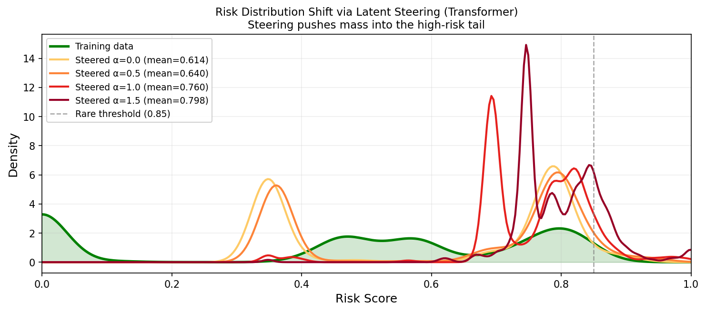

# Latent Space Steering for Controllable Rare Pedestrian Trajectory Generation

**Ananya Arvind** · UCLA · March 2026

> *Can we steer the latent space of an already-trained trajectory predictor to generate rare, high-activity pedestrian behaviors — without any retraining?*

This repository contains the full implementation of **latent space steering** applied to pedestrian trajectory prediction on the [Stanford Drone Dataset (SDD)](https://cvgl.stanford.edu/projects/uav_data/). We train and compare LSTM and Transformer encoders, probe their latent spaces for behavioral risk structure, and demonstrate controllable rare-behavior generation via inference-time latent perturbation.

---

## Key Findings

- **Transformer R² = 0.808** vs **LSTM R² = 0.316** — a 2.55× gap in latent risk linearity, invisible to ADE/FDE
- Structured latent steering outperforms random perturbation by **+0.159** (Transformer) and **+0.141** (LSTM)
- Physical plausibility stays above **94%** throughout steering at α = 1.5
- The Transformer produces geometrically diverse steered trajectories (speed, curvature, direction); the LSTM collapses to speed-dominated responses
- Central takeaway: **ADE/FDE do not capture representation quality** — latent probing R² should be reported alongside standard metrics when a prediction model is used for generation




---

## Repository Structure

```
latent-steering/
├── models/
│   ├── lstm.py              # LSTM encoder + MLP decoder (~145K params)
│   └── transformer.py       # Transformer encoder + MLP decoder (~320K params)
├── utils/
│   ├── dataset.py           # SDD loading, risk score, sliding windows, dataloaders
│   └── steering.py          # PCA whitening, steering vector computation, plausibility
├── train.py                 # Train both models, save checkpoints
├── steer.py                 # Latent probing (R²), steering sweep, random baseline
├── visualize.py             # Generate all figures
├── notebooks/
│   └── colab_training.ipynb # End-to-end Google Colab notebook
├── checkpoints/             # Saved model weights {V1 VERSION USED FOR FIGURES}
├── results/                 # Output figures
└── README.md
```

---

## Setup

No `requirements.txt` is provided — this project was developed on Google Colab, where all dependencies come pre-installed. If running locally, install:

```bash
pip install torch numpy pandas scikit-learn scipy matplotlib tqdm
```

### SDD Data

Download the Stanford Drone Dataset annotations from the [official site](https://cvgl.stanford.edu/projects/uav_data/) (or via [Kaggle](https://www.kaggle.com/datasets/aryashah2k/stanford-drone-dataset)) and place them as:

```
latent-steering/
└── SDD/
    └── annotations/
        ├── bookstore/video0/annotations.txt
        ├── coupa/...
        ├── deathCircle/...
        ├── gates/...
        ├── hyang/...
        ├── little/...
        ├── nexus/...
        └── quad/...
```

8 scenes, 60 annotation files total. Only pedestrian tracks are used.

---

## Usage

### 1. Train

```bash
python train.py SDD/annotations/
```

Trains both LSTM and Transformer. Key hyperparameters:

| Parameter | Value |
|-----------|-------|
| Observation length | 15 frames (0.5s) |
| Prediction length | 25 frames (0.83s) |
| Stride | 5 frames |
| Batch size | 128 |
| Learning rate | 1e-3 (Adam + OneCycleLR) |
| Epochs | 60 |
| Rare threshold | risk ≥ 0.85 (held out entirely) |

Saves `checkpoints/lstm_best.pt` and `checkpoints/transformer_best.pt`.

Expected output:
```
Total windows: 782,033
Normal: 479,840 | Rare (held-out): 302,193
Train: 335,888 | Val: 71,976 | Test: 71,976

LSTM best val ADE:        0.0710 m
Transformer best val ADE: 0.0571 m
```

### 2. Steer

```bash
python steer.py SDD/annotations/
```

Runs latent probing (ridge regression R²), computes the PCA-whitened mean-difference steering vector, sweeps α ∈ [0, 1.5] over 300 validation trajectories, and compares against a random-direction baseline.

Expected output:
```
LSTM        — R²: 0.316 | Structured: 0.897 | Random: 0.756 | Advantage: +0.141
Transformer — R²: 0.808 | Structured: 0.798 | Random: 0.638 | Advantage: +0.159
```

### 3. Visualize

```bash
python visualize.py SDD/annotations/
```

Generates all figures to `results/` using v1 checkpoint as that produced the best results from training:

| File | Description |
|------|-------------|
| `fig1_pca_latent.png` | PCA projections of latent spaces, colored by risk score |
| `fig2_steering_examples.png` | Steered trajectory examples at α ∈ {0, 0.5, 1.0, 1.5} |
| `fig3_kde_risk.png` | KDE of generated risk distribution at increasing α |
| `fig4_cv_baseline.png` | ADE/FDE vs constant-velocity baseline |
| `fig5_summary.png` | R² and steering advantage summary |
| `main_results.png` | Full steering sweep (risk, plausibility, R²) |

---

## Method

### Behavioral Risk Score

Each trajectory window gets a composite activity score r ∈ [0, 1]:

```
r = 0.35 · r_speed + 0.35 · r_accel + 0.30 · r_turn
```

where `r_speed = min(v_max / 3.5, 1)`, `r_accel = min(a_max / 3.0, 1)`, `r_turn = min(ω_max / 3.0, 1)`.

Score near 0 = slow, straight-line motion. Score near 1 = fast, erratic motion. Windows scoring ≥ 0.85 are labeled *rare* and held out entirely from training — the model never sees them, so any rare behaviors generated via steering represent genuine generalization.

### Steering Vector

1. Extract latent vectors {z_i} from the validation set
2. Apply PCA whitening (zero mean, unit variance per PC) to prevent high-variance dimensions from dominating
3. Compute mean difference: `w̃ = mean(Z_hi) − mean(Z_lo)` where hi/lo = top/bottom 10% by risk
4. Project back to original space and ℓ₂-normalize
5. Auto-correct sign so α > 0 always steers toward higher risk
6. At inference: `z' = clip(z + α·w, −0.99, +0.99)`

The 10% percentile threshold was chosen empirically — sweeping 5%/10%/20% showed the structured advantage varies by less than 0.012 across the range.

### Architectures

| | LSTM | Transformer |
|---|---|---|
| Encoder | 2-layer LSTM, hidden 128 | 4-layer self-attention, d=128, 4 heads |
| Latent | Linear + Tanh → z ∈ ℝ⁶⁴ | Mean-pool + Tanh → z ∈ ℝ⁶⁴ |
| Decoder | Shared MLP (64→128→128→50) | Same |
| Params | ~145K | ~320K |
| Val ADE | 0.071 m | 0.057 m |
| Latent R² | 0.316 | **0.808** |

---

## Results

### Prediction Accuracy

| Method | ADE (m) ↓ | FDE (m) ↓ | ΔADE vs CV |
|--------|-----------|-----------|------------|
| Constant Velocity | 0.137 | 0.265 | — |
| LSTM | 0.071 | 0.135 | −48.0% |
| **Transformer** | **0.057** | **0.106** | **−58.3%** |

For context, Social LSTM reported ~0.40 m ADE on SDD pedestrians (different split/normalization), and PECNet reported 9.96 px (≈0.37 m) ADE. Our models operate in a substantially lower error regime, consistent with agent-centric normalization and the full 60-file training set.

### Steering

| | LSTM | Transformer |
|---|---|---|
| Latent R² | 0.316 | **0.808** |
| Structured risk @ α=1.5 | 0.897 | 0.798 |
| Random baseline @ α=1.5 | 0.756 | 0.638 |
| Advantage over random | +0.141 | **+0.159** |
| Plausibility @ α=1.5 | 94.3% | **98.3%** |

---

## Google Colab

The full pipeline is available as a self-contained notebook:

📓 [`notebooks/colab_training.ipynb`](notebooks/colab_training.ipynb)

Steps covered: clone repo → download SDD via Kaggle API → train both models → run steering → generate all figures → download results. Tested on a free-tier T4 GPU (~45 min per model).

---